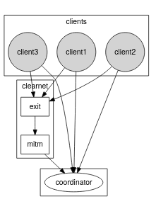
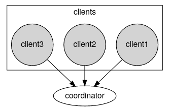
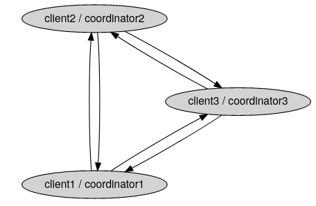
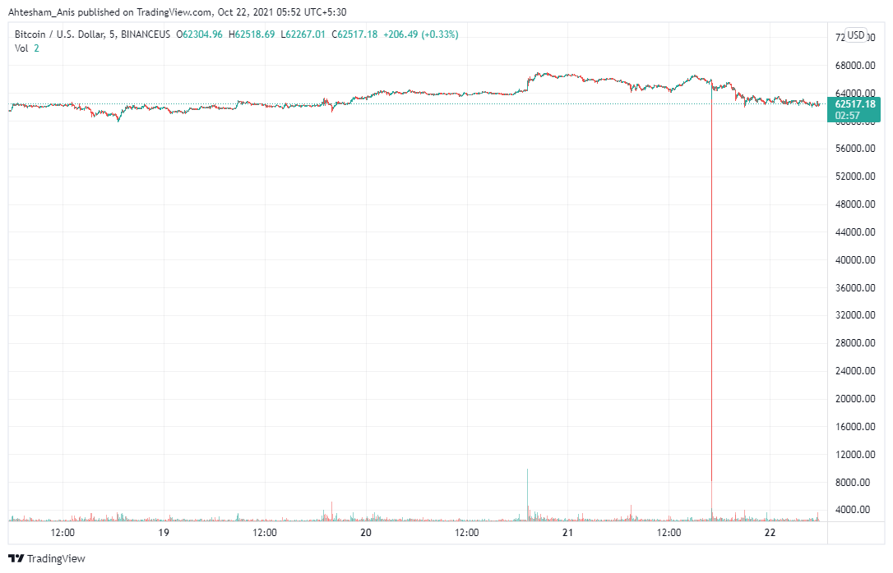

---
title: Wasabito plan overview
...

# Simplification

The _ito_ in Wasab**ito** can be read as "Litle" what in practical terms means Wasabi free of unnecessary things. This is why the first thing to do is to simplify
the wallet by removing as much things as possible. However, the focus is not on removing unnecessary **code** but unneccesary "features". 

The process of removing is rather simple and these are the things that have to be done (many were already done):

## What we have at the moment:

### Remove WW I code

Wasabito doesn't have any user base and then it doesn't need to have a smooth transition to WabiSabi. 
Suporting the two protocols (ZeroLink and WabiSabi) is not good in this context.

#### Remove Sleep Inhibitor

Wasabito will be a daemon and as such it will run even when the GUI
process is not running. On the other hand, preventing a computer to sleep feels unpolite to me.

#### Remove Single-Instance checker

Similar to the previous point, given it will run as a service, a user can open as many instances
of the GUI application as she wants without creating any kind of conflicts because all the resources
will be owned/managed by the service.

#### Remove Terms & Conditions

Service providers can impose restrictions, or add conditions, to the usage of their services but Wasabito
is not a service provider; it is a free and open source project.

#### Remove Legal documents

Same as previous point.

#### Remove password finder

Passwork Finder is simply a bad joke. It is true that it helped a couple of people in the past to recover their
money and as the creator I can only feel proud of that but it has no place in Wasabito. It can be extracted and 
distributed as a separated tool but it cannot be part of this projects.

#### Remove ClearNet backup

ClearNet access is only possible when there is a domain name involved so, a SSL connection can be stablished
to prevent MitM manipulation. However it still leaks some matadata to the exit node. 
Another drawback is that you have to have and static IP address, a http server to deal with the HTTPS requests,
what also assumes the usage fo HTTP protocol and so on.

Protecting a http server from generic DDoS attacks is very difficult and it can lead us to set an intermediary
like Cloudflare with all what that means.

 - This is how Wasabi network looks like

Wasabito should be agnostic in terms of network technology and I assume the most common setup would be 
as an onion service.

  - This is the first goal

Last, the absolutely final goal should be to remove the distinction between client and coordinator by making
every client a coordinator so you can run your own coordinator at night and mix with the friends that you
have in your contact list, and the friends of them.

#### Remove Wallet backup

Wallet json files backup was introduced in Wasabi many years ago because some wallets got corrupted. That's
something that doesn't happen anymore but in case we see that again the solution should be to find the problem 
and fix it.

#### Remove Kitchen

`Kitchen` is a component that keeps the password encrypted in memory. It implicitely assumes that an attacker
with access to the process memory cannot extract the password. That assumption is incorrect.

#### Remove USD/BTC rate clients

Displaying/using USD/BTC rate requires to trust on a thrid-party data provider which gain a lot of power
over the users. We have seen many times how "errors" in the prices displayed by exchanges (the real
source of all the rates) make people to loss lots of money. 

  - See: [Bitcoin price crashed to near $8k on Binance US platform](https://cryptonews.net/news/bitcoin/2331753/)
  - see: [Bug on Kraken Let Users Buy Bitcoin at Levels Below Market Price](https://es.cointelegraph.com/news/bug-on-kraken-let-users-buy-bitcoin-2k-cheaper-and-sell-2k-higher)
  - see: just _google it_, there are many of these cases
  
::::: Alert ::::::::::::::::::
If you provide these rates to your users and they lose money then **you** will be culprit!
::::::::::::::::::::::::::::::

#### Remove compatibility password/config

Wasabito doesn't have an userbase and it is not expected to be used by Wasabi users so, it doesn't make
sense to be compatible in this specific topic.

#### Remove Documentation

Wasabi documentation is completely useless for Wasabito because most of it is HowTos that should be 
automated.

#### Remove bitcoind integration

In its envisioned form Wasabito is a p2p software where every client can act as a coordinator, that 
means that clients need to be able to verify that registered coins are unspent. Also, when not acting
as coordinators, clients need to connect to some node for receiving transactions, getting fetching
blocks and even for getting fee rates. 

Having access to a bitcoin node solves 

| Needs          | No node   | Automatically pruned node   | Manually pruned node   | Full node  |
| -------------- | --------- | --------------------------- | ---------------------- | ---------- |
| Check UTXOs    |           | Yes (RPC)                   | Yes (RPC)              | Yes (RPC)  |
| Receive TXs    | Yes (P2P) | Yes (P2P &                  |                        |            |

This integration assumes the node is in the same machine and
tries to connect with it through rpc and p2p while modifies
the original bitcoin.conf file.

It is mostly used by integration testing and while only very few
people use it, it only provides blocks and fee estimations.

This commit moves the code useful for testing to the testing
project and removes the rest.

* Remove website
* Change GPG public key

# What's next  
* Remove histogram
* Remove CrashReport

* Implement p2p and remove alices/bobs identities
* Remove CoordinationFeeRate & Plebs
* Extract IndexBuilder
* Create RPC (protobuf)
* Extract Fee Rate providers
* Remove Synchronizer
* Compact filter provider
* Review HandleGzipCompression
* Remoe RuntimeParams
* LateResponse delete
* open logs menus. remove
* Dust threshold only for already used addresses
* Remove dust threshold?
* Ban offending coordinators
* Separate UiConfig again
* Task
* Improve amount organization
* Configure CI
* Reduce RangeProofs by shift it right
* Password protected wallet
* Create wcli
* Replace MultiWallet by Multi account
* Add coordinator dropbox
* Backup mechanism
* Add database
* Use SigNet instead of TestNet
* Protocol constants by name
* CoinJoinClient process as continuation
* Make the Std, RangeProofs a function of liquidity

